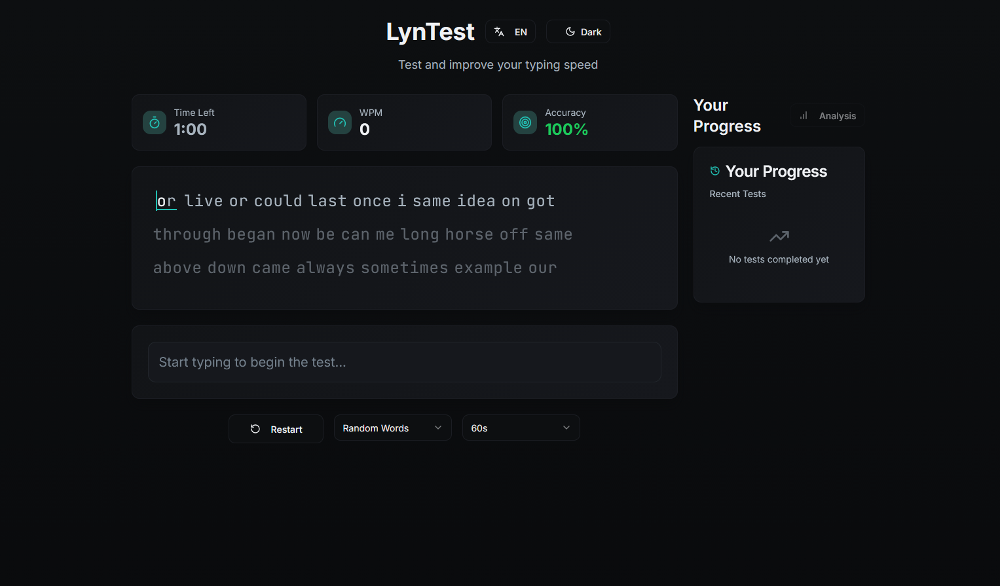

# LynTest - Hızlı Yazma Testi Uygulaması

**[Web Sitesini Ziyaret Edin!](https://lyntest.lynchest.com)**

LynTest, kullanıcıların yazma hızlarını ve doğruluklarını test etmelerini sağlayan modern bir hızlı yazma uygulamasıdır. Temiz ve sezgisel bir arayüzle, kullanıcılar farklı metin kaynakları ve diller üzerinde pratik yapabilir, performanslarını takip edebilir ve yazma becerilerini geliştirebilirler.



## Özellikler

- **Hız ve Doğruluk Testleri:** Kullanıcıların WPM (dakika başına kelime) ve doğruluk oranlarını ölçer.
- **Çoklu Dil Desteği:** Farklı dillerde metin kaynakları sunar.
- **Geçmiş Takibi:** Önceki test sonuçlarını kaydeder ve ilerlemeyi gösterir.
- **Duyarlı Tasarım:** Masaüstü ve mobil cihazlarda sorunsuz bir deneyim sunar.
- **Özelleştirilebilir Ayarlar:** Kullanıcıların test tercihlerini ayarlamasına olanak tanır.

## Teknolojiler

Bu proje aşağıdaki teknolojilerle geliştirilmiştir:

- **Vite:** Hızlı geliştirme deneyimi için yeni nesil frontend aracı.
- **TypeScript:** Daha güvenli ve ölçeklenebilir kod için JavaScript'in tip güvenli bir üst kümesi.
- **React:** Kullanıcı arayüzleri oluşturmak için deklaratif, bileşen tabanlı bir JavaScript kütüphanesi.
- **shadcn-ui:** Erişilebilir ve özelleştirilebilir UI bileşenleri kütüphanesi.
- **Tailwind CSS:** Hızlı ve esnek UI geliştirme için bir yardımcı program öncelikli CSS çerçevesi.

## Yerel Kurulum

Projeyi yerel makinenizde çalıştırmak için aşağıdaki adımları izleyin:

### Önkoşullar

- Node.js (tercihen [nvm](https://github.com/nvm-sh/nvm#installing-and-updating) ile)
- npm (Node.js ile birlikte gelir)

### Adımlar

1.  **Depoyu Klonlayın:**
    ```sh
    git clone https://github.com/lynchest/LynTest.git
    ```

2.  **Proje Dizinine Gidin:**
    ```sh
    cd LynTest
    ```

3.  **Bağımlılıkları Yükleyin:**
    ```sh
    npm install
    ```

4.  **Geliştirme Sunucusunu Başlatın:**
    ```sh
    npm run dev
    ```
    Uygulama genellikle `http://localhost:3030` adresinde çalışacaktır.

## Katkıda Bulunma

LynTest projesine katkıda bulunmak ister misiniz? Katkılarınızı memnuniyetle karşılarız! Lütfen `CONTRIBUTING.md` dosyasını inceleyerek nasıl katkıda bulunabileceğinizi öğrenin.

## Lisans

Bu proje GNU General Public License v3.0 altında lisanslanmıştır. Daha fazla bilgi için `LICENSE` dosyasına bakın.
